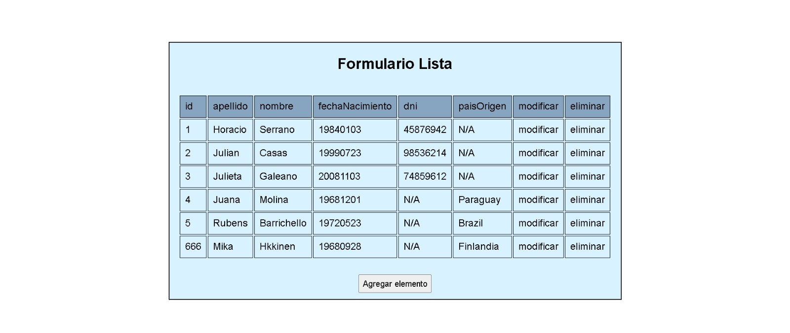
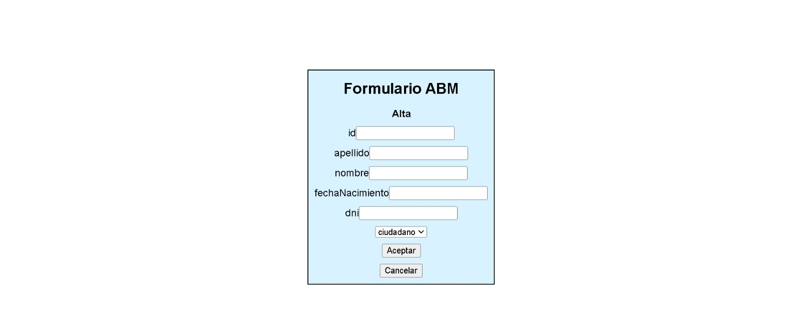

# CRUD (create, read, update, delete) 

### Utilizando HTML, CSS y JAVASCRIPT genero un CRUD a traves del aprovechamiento de la manipulación de objetos html dinámica de DOM. Ademas, se utiliza AJAX para conectarse con una api externa y hay un spinner para cuando se hacen las request

